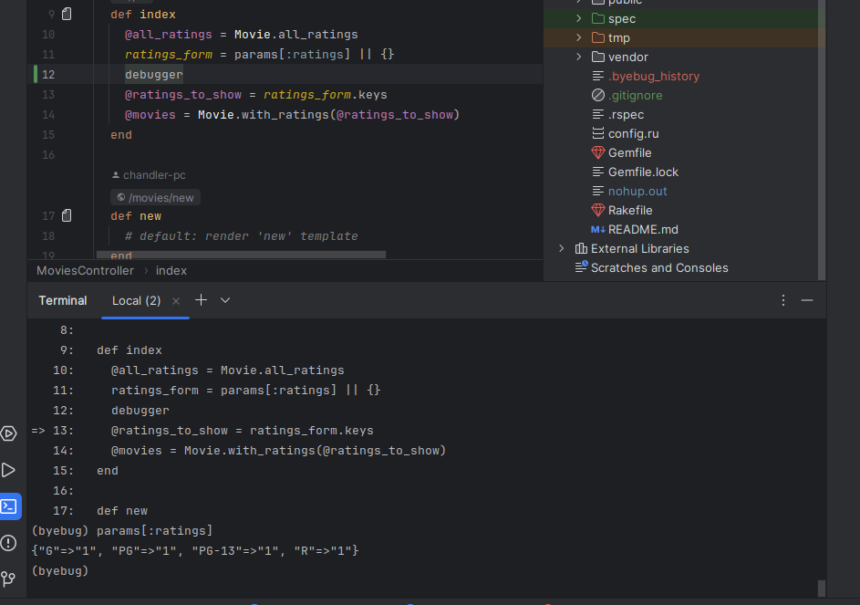
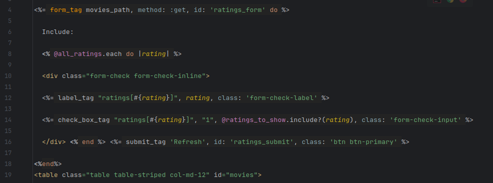
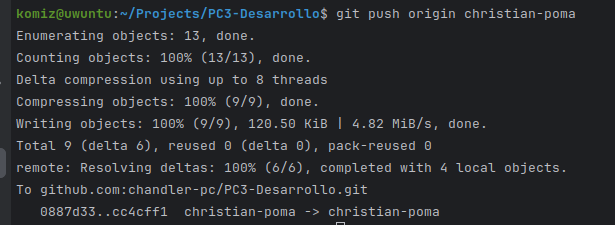
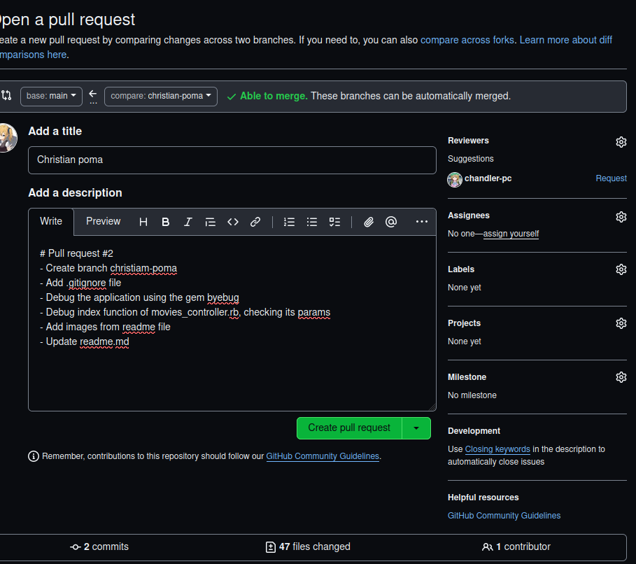

# PC3

Primero clonamos el repositorio y le damos la configuracion inicial


Ahora creamos nuestra rama en la que trabajaremos


Usamos bundle install --without production  para descargar las dependencias y especificar que no estamos en un entorno de produccion.

Ahora inicializamos la primera migracion corriendo rake db:migrate


Pregunta: ¿Cómo decide Rails dónde y cómo crear la base de datos de desarrollo?    
La configuración para la base de datos de desarrollo se define en el archivo config/database.yml, dentro de la sección development. Por defecto, Rails usa SQLite y crea la base de datos development.sqlite3 en el directorio db.  
Los archivos de migración en db/migrate gestionan cambios en la estructura de la base de datos, mientras que db/schema.rb describen la estructura actual.  
Pregunta: ¿Qué tablas se crearon mediante las migraciones?  
En la migracion que hicimos se creo la tabla Movies.  
Ahora insertaremos las semillas, que son datos iniciales para la tabla usando rake db:seed  
Pregunta: ¿Qué datos de semilla se insertaron y dónde se especificaron?  
Los datos que se generaron se encuentran en db/seeds.rb, ademas al correr el comando rake -T db:seed este nos dice que se cargan desde ese archivo


Como vemos, si corremos rails server, nuestra aplicacion ya se ejecuta localmente


Ahora copiamos el codigo para los checkbox en el archivo index.html.erb


Ahora empezamos editando  el codigo para que esta caracteristica de filtrado funcione  
En el codigo de movie.rb le agregamos dos funciones de clase, la primera nos devuelve una lista con los Rating, y la segunda funcion nos devuelve las peliculas, que solo tengan el Rating del checkbox activado  


En el controlador cambiaremos lo que aparece al cargar el index, en este caso primero obtendremos la lista de Rating, luego los valores que los checkbox tienen, obtenemos las llaves de el Hashmap ratings_form, que en este caso seran los checkbox que estan en True, luego de eso usando la funcion de clase Movie.with_ratings obtendremos solo las peliculas que cumplan con el filtro  


Y al correr probamos y vemos que los filtros y el boton refresh ya funcionan  


## Más sugerencias

Utilizamos el debugger para echar un vistazo lo que está dentro de params[:ratings] lo cual lo veremos en la siguiente imagen.



Luego vamos a visualizar dentro del archivo index.html.erb lo siguiente:



En el cual vamos a visualizar el label de div, el cual hará que el formulario funcione correctamente.

Los styles, los cuale en este caso utiliza algunos estilos de Bootstrap, un ejemplo de los estilos que utiliza es `form-check form-check-inline`

Continuaremos comentando la línea debugger del controlador movies_controller.rb para que no interrumpa el flujo del programa.

## Pull request

Continuaremos explicando el proceso de pull request, para esto debemos haber subido nuestros cambios al respositorio.



Ahora debemos generar nuestro pull request que lo podemos hacer desde la misma página de github.



Nos aseguramos que estamos mergeando de nuestra rama a la rama main y procedemos con el pull request.


## Parte 2
## Ordenación de la lista de películas y el coloreo
Para poder ordenar las pelñiculas en la vista index, tenemos que 
modificar la logica de la clase controladora, de la siguiente manera

```ruby
def index
    @all_ratings = Movie.all_ratings
    ratings_form = params[:ratings] || {}
    @ratings_to_show = ratings_form.keys

    # Inicializamos las variables de instancia para las clases de columnas
    @sort_column_class_title = nil
    @sort_column_class_date = nil

    # Ordenamos las películas
    case params[:sort]
    when 'name'
      @movies = Movie.with_ratings(@ratings_to_show).order(:title)
      @sort_column_class_title = 'hilite p-3 mb-2 bg-warning text-dark' if params[:sort] == 'name'
    when 'date'
      @movies = Movie.with_ratings(@ratings_to_show).order(:release_date)
      @sort_column_class_date = 'hilite p-3 mb-2 bg-warning text-dark' if params[:sort] == 'date'
    else
      @movies = Movie.with_ratings(@ratings_to_show)
    end
  end
```
Declaramos variables de instancia dentro de la clase controladora
las cuales iniciamos en ```nil``` para luego determinar las clases CSS
a aplicar en los encabezados.

Establecemos una estructura de control ```case``` para evaluar el parametro
```[params:sort]```, Este parámetro generalmente se establecerá 
cuando se haga click en el encabezado de una columna para ordenar. Si es que
se da click al atributo ```Movie Title``` el cual esta asociado a ```name```
gracias a Active Record podemos ordenar con su método ```order``` y 
le pasamos por parámetro el elemento a ordenar ya sea ```:title``` o ```:release_date```
a su vez se establece ya sea ```@sort_column_class_title``` o ```@sort_column_class_date```
con la clase CSS correspondiente para que pueda resaltar y colorear como se indica.
Si de lo contrario no se hace click en ninguna de las columnas
se listara todas las peliculas que estan dentro de la base de datos.

También se tuvo que hacer modificaciones dentro de la vista, en nuestro
caso seguimos usando el formato de archivo ```hmtl.erb```

```rhtml
<tr>
      <th><%= link_to "Movie Title", { :sort => "name", :ratings => params[:ratings] }, { :class => @sort_column_class_title } %></th>
      <th>Rating</th>
      <th><%= link_to "Release Date", { :sort => "date", :ratings => params[:ratings] }, { :class => @sort_column_class_date } %></th>
      <th>More Info</th>
    </tr>
```
Usamos el método helper ```link_to```, para que nos redireccione 
a un enlace que contenga el nombre, se pasan dos parámetros 
a la ruta especificada por el enlace.
```:sort``` con el valor ```"name"``` indica que se está ordenando por 
el título, y ```:ratings``` se establece con el valor de las 
clasificaciones actuales (recuperado de params[:ratings]). 
Esto asegura que las clasificaciones seleccionadas se conserven 
al hacer click en el enlace. Para después se establece la clase CSS 
del enlace. La clase se determina en el controlador.

Capturas:


