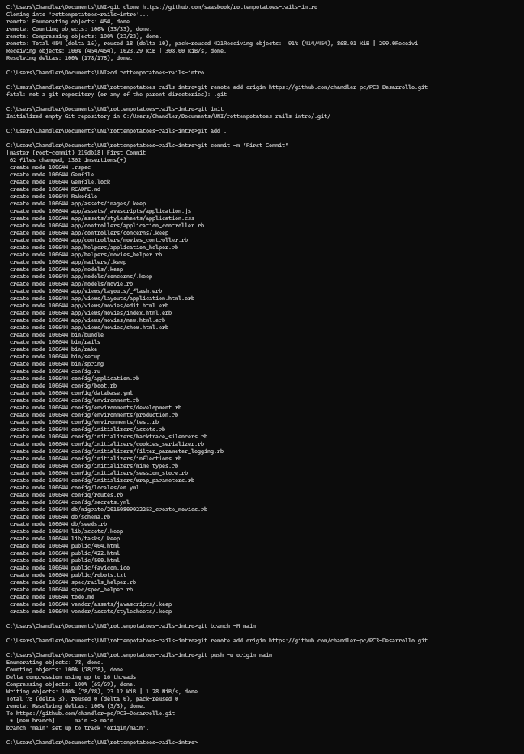
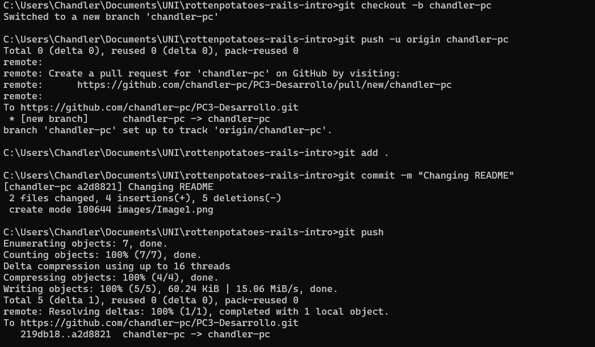
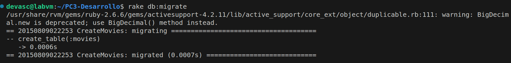
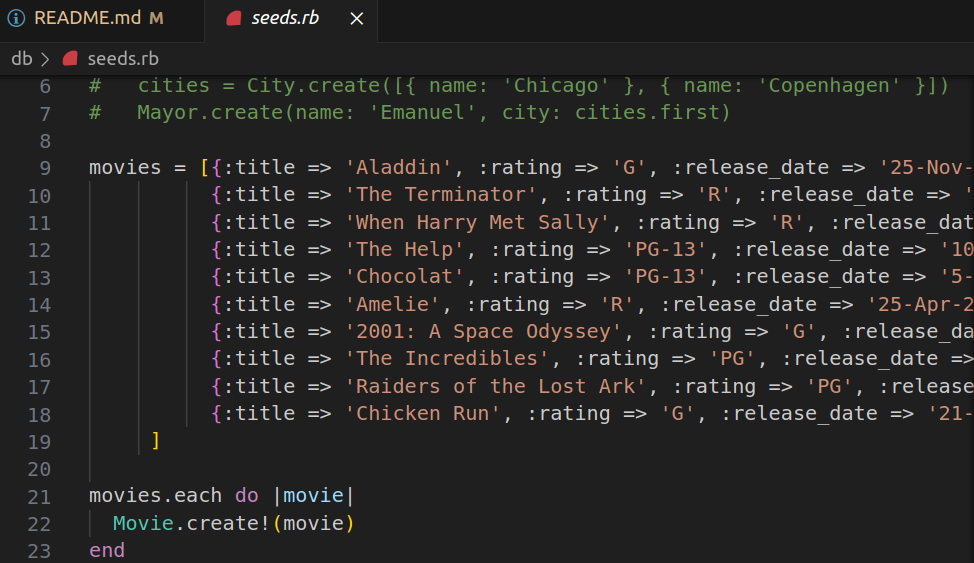
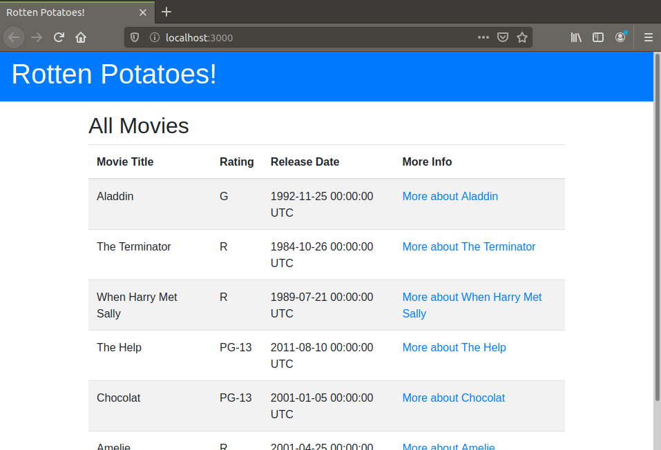
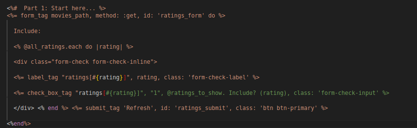
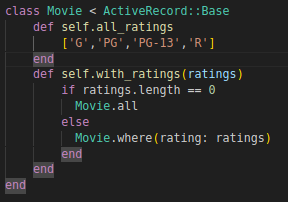
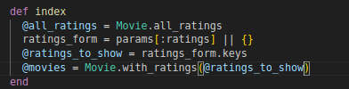
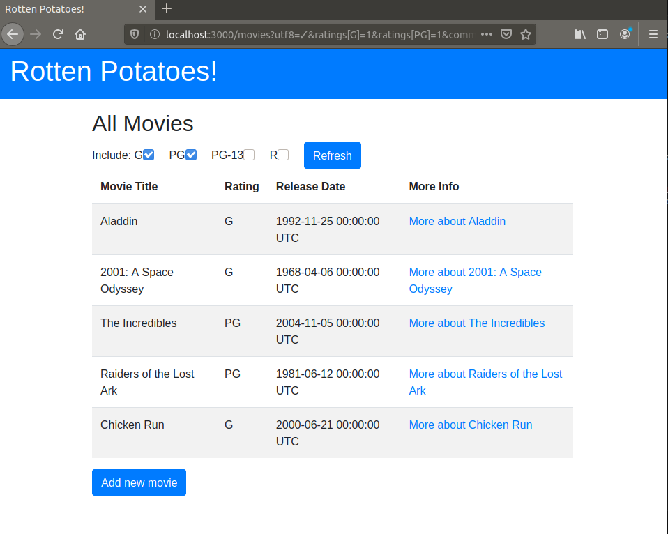

# PC3

Primero clonamos el repositorio y le damos la configuracion inicial

Ahora creamos nuestra rama en la que trabajaremos

Usamos bundle install --without production  para descargar las dependencias y especificar que no estamos en un entorno de produccion.

Ahora inicializamos la primera migracion corriendo rake db:migrate

Pregunta: ¿Cómo decide Rails dónde y cómo crear la base de datos de desarrollo?    
La configuración para la base de datos de desarrollo se define en el archivo config/database.yml, dentro de la sección development. Por defecto, Rails usa SQLite y crea la base de datos development.sqlite3 en el directorio db.  
Los archivos de migración en db/migrate gestionan cambios en la estructura de la base de datos, mientras que db/schema.rb describen la estructura actual.  
Pregunta: ¿Qué tablas se crearon mediante las migraciones?  
En la migracion que hicimos se creo la tabla Movies.  
Ahora insertaremos las semillas, que son datos iniciales para la tabla usando rake db:seed  
Pregunta: ¿Qué datos de semilla se insertaron y dónde se especificaron?  
Los datos que se generaron se encuentran en db/seeds.rb, ademas al correr el comando rake -T db:seed este nos dice que se cargan desde ese archivo

Como vemos, si corremos rails server, nuestra aplicacion ya se ejecuta localmente

Ahora copiamos el codigo para los checkbox en el archivo index.html.erb

Ahora empezamos editando  el codigo para que esta caracteristica de filtrado funcione  
En el codigo de movie.rb le agregamos dos funciones de clase, la primera nos devuelve una lista con los Rating, y la segunda funcion nos devuelve las peliculas, que solo tengan el Rating del checkbox activado  

En el controlador cambiaremos lo que aparece al cargar el index, en este caso primero obtendremos la lista de Rating, luego los valores que los checkbox tienen, obtenemos las llaves de el Hashmap ratings_form, que en este caso seran los checkbox que estan en True, luego de eso usando la funcion de clase Movie.with_ratings obtendremos solo las peliculas que cumplan con el filtro  

Y al correr probamos y vemos que los filtros y el boton refresh ya funcionan  
